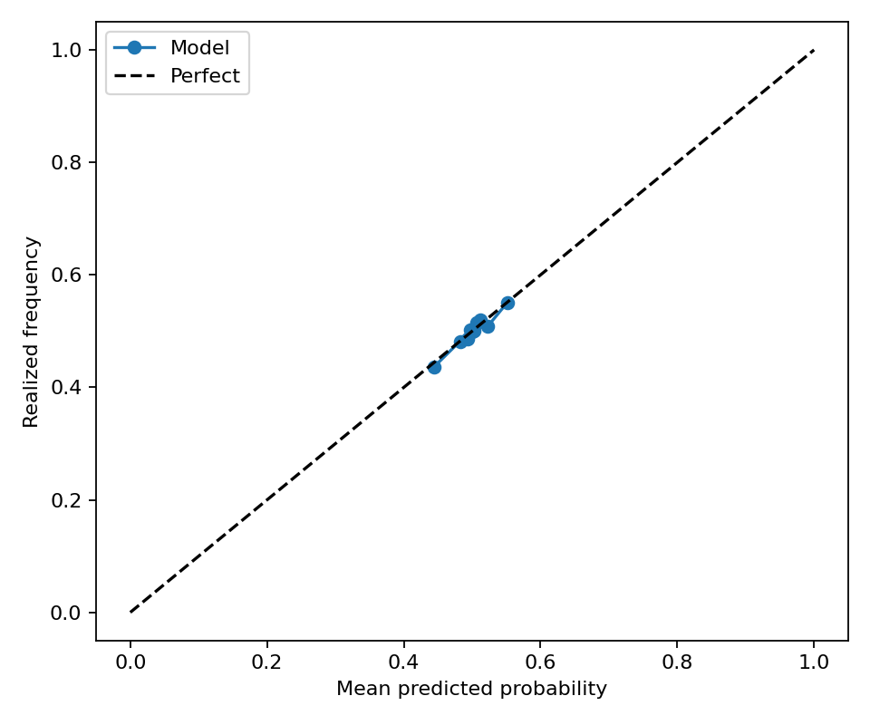
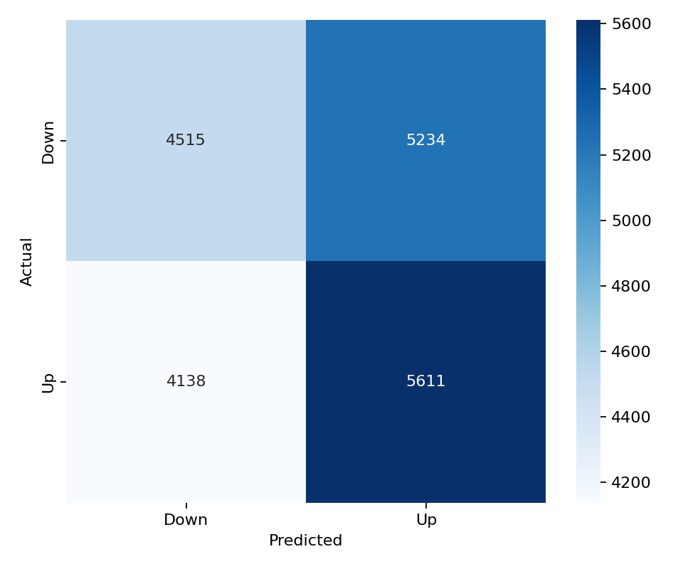

# BNB 15-Minute Direction Model

This folder contains a balanced LightGBM direction model for `BNB_USDT`. It uses the same 43 feature columns, LightGBM hyperparameters, walk-forward split configuration, balanced train/validation/test sampling, and evaluation metric suite as the latest BTC balanced model.

## Files

- `models/lightgbm_model.pkl`: saved walk-forward LightGBM model ensemble.
- `models/feature_list.csv`: ordered model feature list copied from the BTC balanced model.
- `predictions/test_predictions.parquet`: balanced walk-forward test predictions.
- `predictions/validation_predictions.parquet`: balanced validation predictions.
- `metrics/classification_metrics.json`: test classification metrics.
- `metrics/validation_classification_metrics.json`: validation classification metrics.
- `metrics/regime_metrics.csv`: test metrics split by volatility and trading-session regimes.
- `metrics/validation_regime_metrics.csv`: validation metrics split by volatility and trading-session regimes.
- `figures/validation_calibration_curve.png`: validation calibration curve.
- `figures/validation_confusion_matrix.png`: validation confusion matrix.

## Data

- Raw aligned rows: 49,999
- Feature dataset rows: 35,127
- Model features: 43
- Target: `1` means BNB closes higher over the next 15-minute bar; `0` means flat/down.

The class balance report is saved at `metrics/split_class_balance.csv`. Each train, validation, and test split is balanced independently after chronological splitting to avoid cross-contamination.

## Model Architecture

LightGBM parameters:

```json
{
  "colsample_bytree": 0.8,
  "force_col_wise": true,
  "learning_rate": 0.01,
  "max_depth": 8,
  "n_estimators": 2000,
  "n_jobs": -1,
  "num_leaves": 64,
  "objective": "binary",
  "random_state": 42,
  "reg_alpha": 1.0,
  "reg_lambda": 1.0,
  "subsample": 0.8,
  "verbosity": -1
}
```

Walk-forward split:

```json
{
  "step_bars": 2000,
  "test_bars": 2000,
  "train_bars": 12000,
  "val_bars": 2000
}
```

## Performance

| Dataset | Rows | UP ratio | Accuracy | Balanced accuracy | ROC AUC | F1 | Precision | Recall | MCC |
| --- | ---: | ---: | ---: | ---: | ---: | ---: | ---: | ---: | ---: |
| test | 19,448 | 0.5000 | 0.5202 | 0.5202 | 0.5259 | 0.5464 | 0.5181 | 0.5780 | 0.0407 |
| validation | 19,498 | 0.5000 | 0.5193 | 0.5193 | 0.5300 | 0.5449 | 0.5174 | 0.5755 | 0.0389 |

## Regime Performance

Test regimes:

| Regime | Rows | UP ratio | Accuracy | Balanced accuracy | ROC AUC | F1 |
| --- | ---: | ---: | ---: | ---: | ---: | ---: |
| volatility_regime=low | 5,492 | 0.4936 | 0.5248 | 0.5249 | 0.5352 | 0.5270 |
| session_europe=0 | 12,161 | 0.5018 | 0.5233 | 0.5231 | 0.5321 | 0.5481 |
| session_asia=1 | 6,481 | 0.4968 | 0.5209 | 0.5213 | 0.5254 | 0.5489 |
| session_us=1 | 7,301 | 0.5064 | 0.5214 | 0.5207 | 0.5277 | 0.5490 |
| session_us=0 | 12,147 | 0.4962 | 0.5195 | 0.5199 | 0.5249 | 0.5448 |
| session_asia=0 | 12,967 | 0.5016 | 0.5199 | 0.5197 | 0.5262 | 0.5451 |
| volatility_regime=medium | 6,576 | 0.4983 | 0.5181 | 0.5184 | 0.5191 | 0.5551 |
| volatility_regime=high | 7,380 | 0.5062 | 0.5187 | 0.5179 | 0.5241 | 0.5521 |
| session_europe=1 | 7,287 | 0.4970 | 0.5150 | 0.5154 | 0.5159 | 0.5435 |

Validation regimes:

| Regime | Rows | UP ratio | Accuracy | Balanced accuracy | ROC AUC | F1 |
| --- | ---: | ---: | ---: | ---: | ---: | ---: |
| volatility_regime=medium | 6,851 | 0.4992 | 0.5243 | 0.5244 | 0.5312 | 0.5507 |
| session_europe=0 | 12,197 | 0.5041 | 0.5241 | 0.5236 | 0.5328 | 0.5505 |
| session_asia=1 | 6,516 | 0.4985 | 0.5227 | 0.5229 | 0.5297 | 0.5481 |
| session_us=0 | 12,196 | 0.4975 | 0.5204 | 0.5207 | 0.5326 | 0.5432 |
| volatility_regime=low | 4,516 | 0.4920 | 0.5190 | 0.5197 | 0.5370 | 0.5331 |
| session_asia=0 | 12,982 | 0.5008 | 0.5176 | 0.5176 | 0.5302 | 0.5433 |
| session_us=1 | 7,302 | 0.5041 | 0.5175 | 0.5170 | 0.5257 | 0.5477 |
| volatility_regime=high | 8,131 | 0.5051 | 0.5153 | 0.5147 | 0.5250 | 0.5464 |
| session_europe=1 | 7,301 | 0.4931 | 0.5114 | 0.5123 | 0.5254 | 0.5356 |

Best test regime by balanced accuracy: `volatility_regime=low` with balanced accuracy 0.5249 and ROC AUC 0.5352.

Best validation regime by balanced accuracy: `volatility_regime=medium` with balanced accuracy 0.5244 and ROC AUC 0.5312.

## Feature Importance

Top features by mean absolute SHAP:

| Feature | Mean abs SHAP |
| --- | ---: |
| `rolling_return_3` | 0.02962 |
| `rolling_return_15` | 0.01259 |
| `vwap_distance` | 0.01018 |
| `rolling_return_5` | 0.00845 |
| `rolling_return_30` | 0.00838 |
| `rolling_volatility_5` | 0.00769 |
| `rolling_volatility_3` | 0.00748 |
| `volume` | 0.00740 |
| `hurst_exponent` | 0.00649 |
| `realized_volatility_3` | 0.00619 |

Top features by LightGBM gain:

| Feature | Gain |
| --- | ---: |
| `rolling_return_3` | 2046.13927 |
| `rolling_return_15` | 1294.83108 |
| `funding_zscore` | 1227.04795 |
| `volume` | 1216.17307 |
| `hurst_exponent` | 1194.09656 |
| `rolling_return_5` | 1150.97133 |
| `rolling_entropy` | 1110.79146 |
| `rolling_return_30` | 1042.75930 |
| `vwap_distance` | 992.20225 |
| `rolling_volatility_5` | 975.66530 |

## Validation Figures




