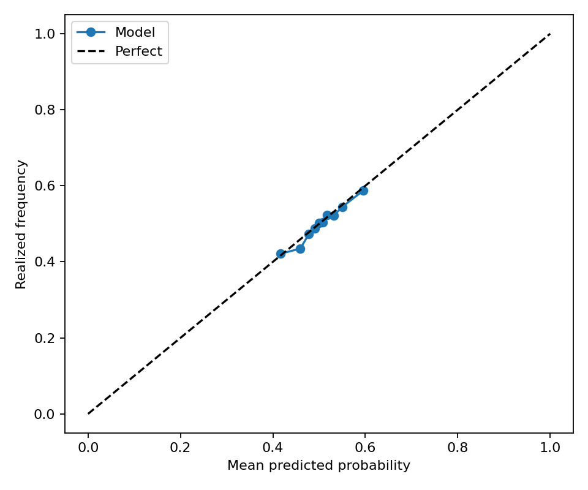
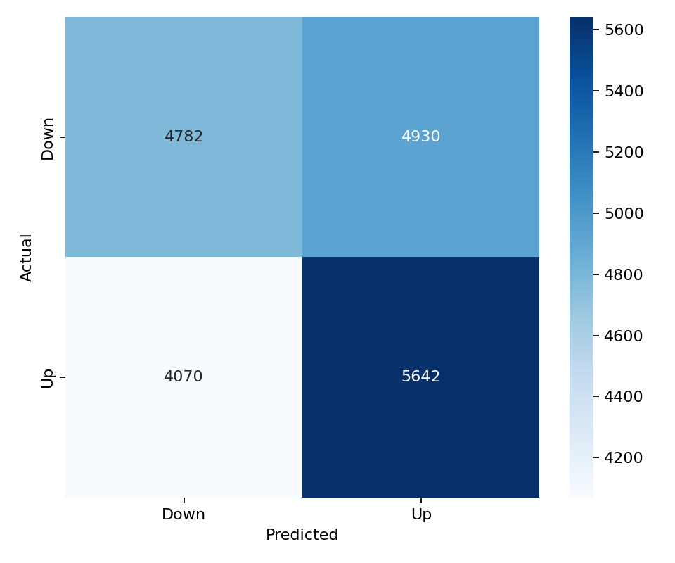

# DOGE 15-Minute Direction Model

This folder contains a balanced LightGBM direction model for `DOGE_USDT`. It uses the same 43 feature columns, LightGBM hyperparameters, walk-forward split configuration, balanced train/validation/test sampling, and evaluation metric suite as the latest BTC balanced model.

## Files

- `models/lightgbm_model.pkl`: saved walk-forward LightGBM model ensemble.
- `models/feature_list.csv`: ordered model feature list copied from the BTC balanced model.
- `predictions/test_predictions.parquet`: balanced walk-forward test predictions.
- `predictions/validation_predictions.parquet`: balanced validation predictions.
- `metrics/classification_metrics.json`: test classification metrics.
- `metrics/validation_classification_metrics.json`: validation classification metrics.
- `metrics/regime_metrics.csv`: test metrics split by volatility and trading-session regimes.
- `metrics/validation_regime_metrics.csv`: validation metrics split by volatility and trading-session regimes.
- `figures/validation_calibration_curve.png`: validation calibration curve.
- `figures/validation_confusion_matrix.png`: validation confusion matrix.

## Data

- Raw aligned rows: 49,999
- Feature dataset rows: 35,127
- Model features: 43
- Target: `1` means DOGE closes higher over the next 15-minute bar; `0` means flat/down.

The class balance report is saved at `metrics/split_class_balance.csv`. Each train, validation, and test split is balanced independently after chronological splitting to avoid cross-contamination.

## Model Architecture

LightGBM parameters:

```json
{
  "colsample_bytree": 0.8,
  "force_col_wise": true,
  "learning_rate": 0.01,
  "max_depth": 8,
  "n_estimators": 2000,
  "n_jobs": -1,
  "num_leaves": 64,
  "objective": "binary",
  "random_state": 42,
  "reg_alpha": 1.0,
  "reg_lambda": 1.0,
  "subsample": 0.8,
  "verbosity": -1
}
```

Walk-forward split:

```json
{
  "step_bars": 2000,
  "test_bars": 2000,
  "train_bars": 12000,
  "val_bars": 2000
}
```

## Performance

| Dataset | Rows | UP ratio | Accuracy | Balanced accuracy | ROC AUC | F1 | Precision | Recall | MCC |
| --- | ---: | ---: | ---: | ---: | ---: | ---: | ---: | ---: | ---: |
| test | 19,414 | 0.5000 | 0.5276 | 0.5276 | 0.5397 | 0.5537 | 0.5247 | 0.5861 | 0.0556 |
| validation | 19,424 | 0.5000 | 0.5367 | 0.5367 | 0.5530 | 0.5563 | 0.5337 | 0.5809 | 0.0736 |

## Regime Performance

Test regimes:

| Regime | Rows | UP ratio | Accuracy | Balanced accuracy | ROC AUC | F1 |
| --- | ---: | ---: | ---: | ---: | ---: | ---: |
| session_europe=1 | 7,262 | 0.5014 | 0.5348 | 0.5347 | 0.5487 | 0.5639 |
| volatility_regime=medium | 6,068 | 0.5069 | 0.5351 | 0.5342 | 0.5516 | 0.5663 |
| session_us=0 | 12,133 | 0.4961 | 0.5300 | 0.5304 | 0.5451 | 0.5477 |
| session_asia=1 | 6,463 | 0.4950 | 0.5287 | 0.5291 | 0.5425 | 0.5440 |
| volatility_regime=low | 8,798 | 0.4991 | 0.5286 | 0.5287 | 0.5409 | 0.5542 |
| session_asia=0 | 12,951 | 0.5025 | 0.5271 | 0.5267 | 0.5383 | 0.5584 |
| session_europe=0 | 12,152 | 0.4992 | 0.5233 | 0.5234 | 0.5343 | 0.5475 |
| session_us=1 | 7,281 | 0.5065 | 0.5236 | 0.5225 | 0.5300 | 0.5632 |
| volatility_regime=high | 4,548 | 0.4925 | 0.5156 | 0.5164 | 0.5210 | 0.5353 |

Validation regimes:

| Regime | Rows | UP ratio | Accuracy | Balanced accuracy | ROC AUC | F1 |
| --- | ---: | ---: | ---: | ---: | ---: | ---: |
| volatility_regime=medium | 6,700 | 0.5075 | 0.5585 | 0.5579 | 0.5721 | 0.5801 |
| session_europe=1 | 7,270 | 0.5014 | 0.5435 | 0.5433 | 0.5546 | 0.5647 |
| session_us=1 | 7,264 | 0.5091 | 0.5390 | 0.5376 | 0.5515 | 0.5757 |
| session_asia=0 | 12,938 | 0.5036 | 0.5380 | 0.5375 | 0.5533 | 0.5650 |
| session_us=0 | 12,160 | 0.4946 | 0.5353 | 0.5355 | 0.5534 | 0.5439 |
| session_asia=1 | 6,486 | 0.4929 | 0.5341 | 0.5343 | 0.5517 | 0.5381 |
| session_europe=0 | 12,154 | 0.4992 | 0.5326 | 0.5327 | 0.5519 | 0.5512 |
| volatility_regime=low | 7,865 | 0.4997 | 0.5299 | 0.5300 | 0.5477 | 0.5462 |
| volatility_regime=high | 4,859 | 0.4902 | 0.5174 | 0.5185 | 0.5353 | 0.5396 |

Best test regime by balanced accuracy: `session_europe=1` with balanced accuracy 0.5347 and ROC AUC 0.5487.

Best validation regime by balanced accuracy: `volatility_regime=medium` with balanced accuracy 0.5579 and ROC AUC 0.5721.

## Feature Importance

Top features by mean absolute SHAP:

| Feature | Mean abs SHAP |
| --- | ---: |
| `rolling_return_3` | 0.04458 |
| `log_return` | 0.03578 |
| `vwap_distance` | 0.03398 |
| `rolling_return_5` | 0.02138 |
| `close_open_range` | 0.01416 |
| `funding_zscore` | 0.01356 |
| `volume` | 0.01231 |
| `rolling_volatility_3` | 0.01131 |
| `parkinson_volatility_3` | 0.01113 |
| `rolling_return_30` | 0.01110 |

Top features by LightGBM gain:

| Feature | Gain |
| --- | ---: |
| `vwap_distance` | 3226.41421 |
| `rolling_return_3` | 2993.73389 |
| `volume` | 2519.01315 |
| `log_return` | 2397.91335 |
| `rolling_return_5` | 2267.14133 |
| `rolling_entropy` | 2248.69473 |
| `funding_zscore` | 2195.38647 |
| `rolling_return_30` | 2005.25814 |
| `hurst_exponent` | 1954.21939 |
| `rolling_return_15` | 1920.39379 |

## Validation Figures




