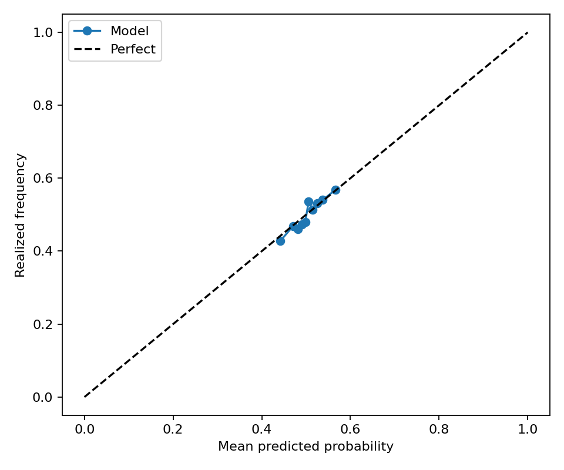
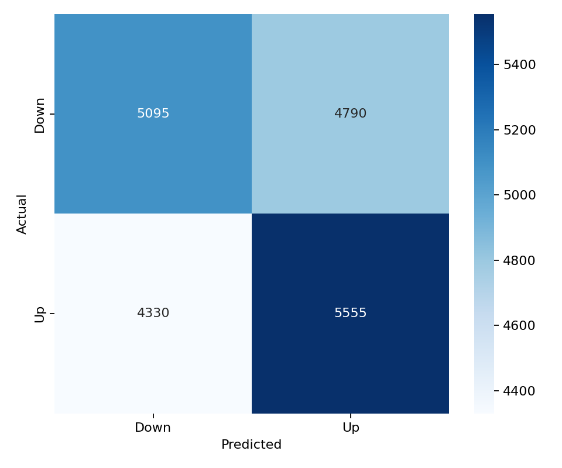

# ETH 15-Minute Direction Model

This folder contains a balanced LightGBM direction model for `ETH_USDT`. It uses the same 43 feature columns, LightGBM hyperparameters, walk-forward split configuration, balanced train/validation/test sampling, and evaluation metric suite as the latest BTC balanced model.

## Files

- `models/lightgbm_model.pkl`: saved walk-forward LightGBM model ensemble.
- `models/feature_list.csv`: ordered model feature list copied from the BTC balanced model.
- `predictions/test_predictions.parquet`: balanced walk-forward test predictions.
- `predictions/validation_predictions.parquet`: balanced validation predictions.
- `metrics/classification_metrics.json`: test classification metrics.
- `metrics/validation_classification_metrics.json`: validation classification metrics.
- `metrics/regime_metrics.csv`: test metrics split by volatility and trading-session regimes.
- `metrics/validation_regime_metrics.csv`: validation metrics split by volatility and trading-session regimes.
- `figures/validation_calibration_curve.png`: validation calibration curve.
- `figures/validation_confusion_matrix.png`: validation confusion matrix.

## Data

- Raw aligned rows: 50,000
- Feature dataset rows: 35,126
- Model features: 43
- Target: `1` means ETH closes higher over the next 15-minute bar; `0` means flat/down.

The class balance report is saved at `metrics/split_class_balance.csv`. Each train, validation, and test split is balanced independently after chronological splitting to avoid cross-contamination.

## Model Architecture

LightGBM parameters:

```json
{
  "colsample_bytree": 0.8,
  "force_col_wise": true,
  "learning_rate": 0.01,
  "max_depth": 8,
  "n_estimators": 2000,
  "n_jobs": -1,
  "num_leaves": 64,
  "objective": "binary",
  "random_state": 42,
  "reg_alpha": 1.0,
  "reg_lambda": 1.0,
  "subsample": 0.8,
  "verbosity": -1
}
```

Walk-forward split:

```json
{
  "step_bars": 2000,
  "test_bars": 2000,
  "train_bars": 12000,
  "val_bars": 2000
}
```

## Performance

| Dataset | Rows | UP ratio | Accuracy | Balanced accuracy | ROC AUC | F1 | Precision | Recall | MCC |
| --- | ---: | ---: | ---: | ---: | ---: | ---: | ---: | ---: | ---: |
| test | 19,788 | 0.5000 | 0.5303 | 0.5303 | 0.5381 | 0.5551 | 0.5272 | 0.5860 | 0.0609 |
| validation | 19,770 | 0.5000 | 0.5387 | 0.5387 | 0.5472 | 0.5492 | 0.5370 | 0.5620 | 0.0775 |

## Regime Performance

Test regimes:

| Regime | Rows | UP ratio | Accuracy | Balanced accuracy | ROC AUC | F1 |
| --- | ---: | ---: | ---: | ---: | ---: | ---: |
| volatility_regime=low | 6,555 | 0.5024 | 0.5388 | 0.5387 | 0.5497 | 0.5558 |
| volatility_regime=medium | 6,412 | 0.5005 | 0.5315 | 0.5314 | 0.5389 | 0.5581 |
| session_europe=0 | 12,380 | 0.4978 | 0.5307 | 0.5309 | 0.5391 | 0.5529 |
| session_asia=1 | 6,596 | 0.4985 | 0.5306 | 0.5308 | 0.5362 | 0.5559 |
| session_us=0 | 12,370 | 0.5001 | 0.5306 | 0.5306 | 0.5357 | 0.5542 |
| session_asia=0 | 13,192 | 0.5008 | 0.5301 | 0.5300 | 0.5390 | 0.5546 |
| session_us=1 | 7,418 | 0.4999 | 0.5297 | 0.5297 | 0.5420 | 0.5565 |
| session_europe=1 | 7,408 | 0.5036 | 0.5296 | 0.5291 | 0.5362 | 0.5586 |
| volatility_regime=high | 6,821 | 0.4973 | 0.5209 | 0.5213 | 0.5256 | 0.5516 |

Validation regimes:

| Regime | Rows | UP ratio | Accuracy | Balanced accuracy | ROC AUC | F1 |
| --- | ---: | ---: | ---: | ---: | ---: | ---: |
| volatility_regime=low | 6,561 | 0.5039 | 0.5447 | 0.5446 | 0.5554 | 0.5532 |
| session_europe=0 | 12,368 | 0.4984 | 0.5437 | 0.5438 | 0.5520 | 0.5512 |
| session_us=1 | 7,395 | 0.5030 | 0.5402 | 0.5401 | 0.5535 | 0.5507 |
| session_asia=1 | 6,605 | 0.4987 | 0.5397 | 0.5398 | 0.5477 | 0.5487 |
| session_asia=0 | 13,165 | 0.5006 | 0.5382 | 0.5381 | 0.5470 | 0.5494 |
| session_us=0 | 12,375 | 0.4982 | 0.5378 | 0.5379 | 0.5434 | 0.5483 |
| volatility_regime=medium | 6,255 | 0.4970 | 0.5357 | 0.5358 | 0.5505 | 0.5412 |
| volatility_regime=high | 6,954 | 0.4990 | 0.5357 | 0.5357 | 0.5360 | 0.5525 |
| session_europe=1 | 7,402 | 0.5027 | 0.5303 | 0.5301 | 0.5396 | 0.5459 |

Best test regime by balanced accuracy: `volatility_regime=low` with balanced accuracy 0.5387 and ROC AUC 0.5497.

Best validation regime by balanced accuracy: `volatility_regime=low` with balanced accuracy 0.5446 and ROC AUC 0.5554.

## Feature Importance

Top features by mean absolute SHAP:

| Feature | Mean abs SHAP |
| --- | ---: |
| `log_return` | 0.03335 |
| `rolling_return_3` | 0.03249 |
| `vwap_distance` | 0.02141 |
| `rolling_return_15` | 0.01407 |
| `close_open_range` | 0.01357 |
| `rolling_return_5` | 0.01329 |
| `rolling_volatility_3` | 0.01038 |
| `rolling_return_30` | 0.00956 |
| `volume` | 0.00865 |
| `hurst_exponent` | 0.00780 |

Top features by LightGBM gain:

| Feature | Gain |
| --- | ---: |
| `rolling_return_3` | 2156.78067 |
| `log_return` | 1957.06347 |
| `vwap_distance` | 1659.95208 |
| `volume` | 1492.04707 |
| `rolling_return_15` | 1419.70544 |
| `funding_zscore` | 1359.75198 |
| `rolling_entropy` | 1357.21486 |
| `rolling_return_5` | 1350.62635 |
| `rolling_volatility_3` | 1311.87141 |
| `rolling_return_30` | 1227.88741 |

## Validation Figures




