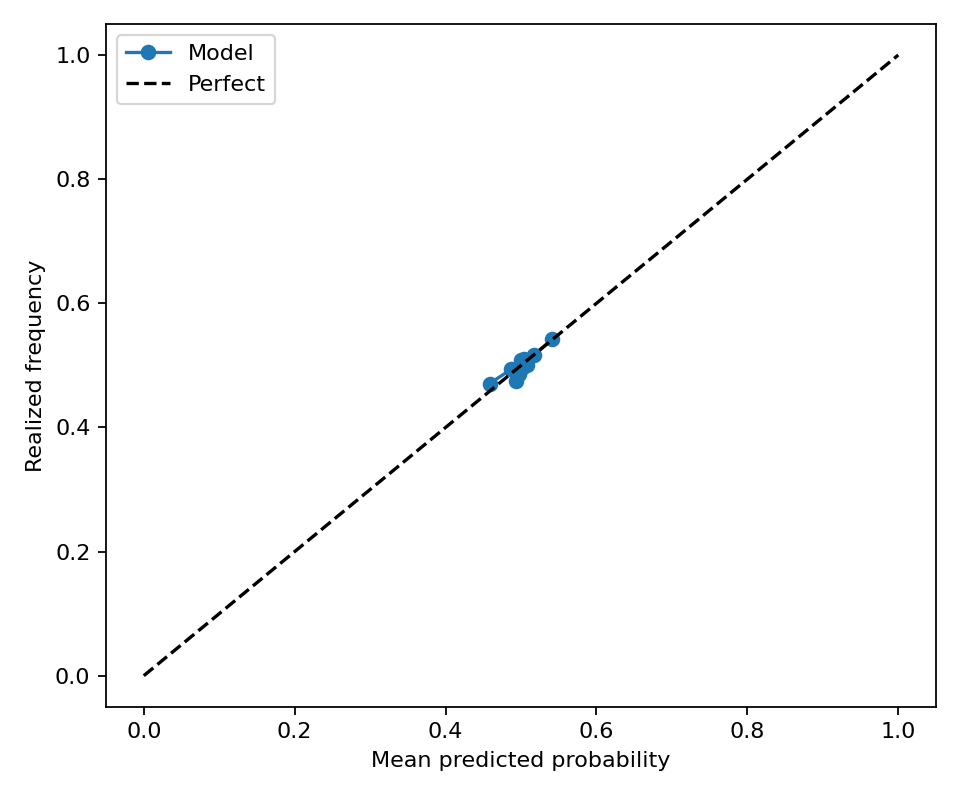
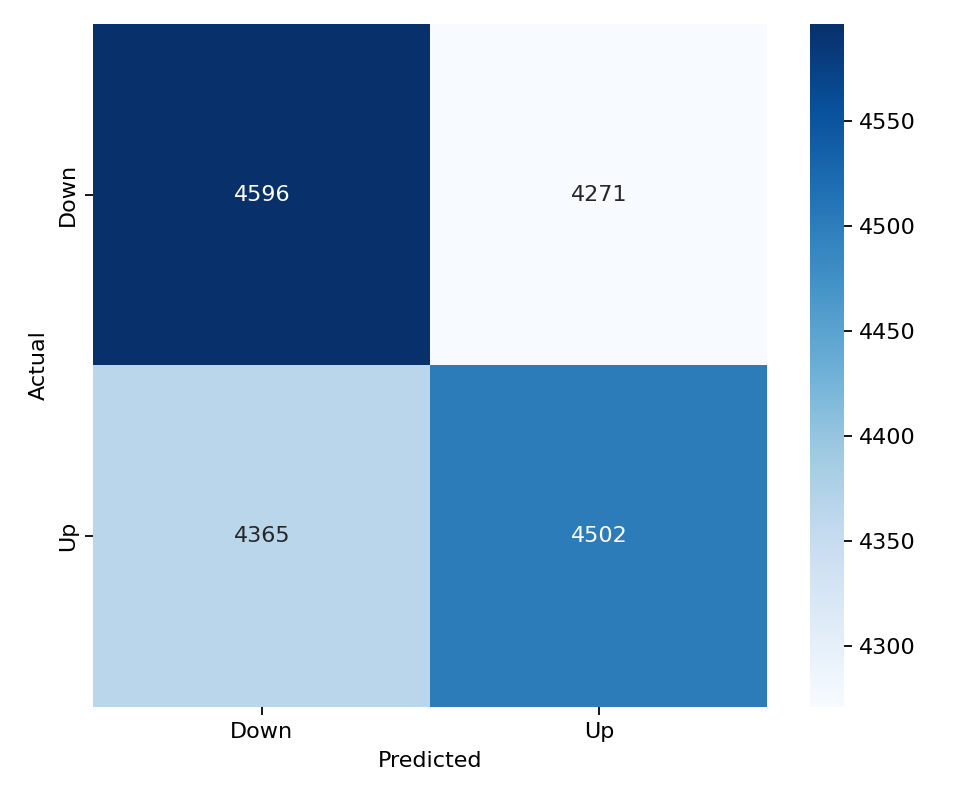

# HYPE 15-Minute Direction Model

This folder contains a balanced LightGBM direction model for `HYPE_USDT`. It uses the same 43 feature columns, LightGBM hyperparameters, walk-forward split configuration, balanced train/validation/test sampling, and evaluation metric suite as the latest BTC balanced model.

## Files

- `models/lightgbm_model.pkl`: saved walk-forward LightGBM model ensemble.
- `models/feature_list.csv`: ordered model feature list copied from the BTC balanced model.
- `predictions/test_predictions.parquet`: balanced walk-forward test predictions.
- `predictions/validation_predictions.parquet`: balanced validation predictions.
- `metrics/classification_metrics.json`: test classification metrics.
- `metrics/validation_classification_metrics.json`: validation classification metrics.
- `metrics/regime_metrics.csv`: test metrics split by volatility and trading-session regimes.
- `metrics/validation_regime_metrics.csv`: validation metrics split by volatility and trading-session regimes.
- `figures/validation_calibration_curve.png`: validation calibration curve.
- `figures/validation_confusion_matrix.png`: validation confusion matrix.

## Data

- Raw aligned rows: 33,365
- Feature dataset rows: 33,065
- Model features: 43
- Target: `1` means HYPE closes higher over the next 15-minute bar; `0` means flat/down.

The class balance report is saved at `metrics/split_class_balance.csv`. Each train, validation, and test split is balanced independently after chronological splitting to avoid cross-contamination.

## Model Architecture

LightGBM parameters:

```json
{
  "colsample_bytree": 0.8,
  "force_col_wise": true,
  "learning_rate": 0.01,
  "max_depth": 8,
  "n_estimators": 2000,
  "n_jobs": -1,
  "num_leaves": 64,
  "objective": "binary",
  "random_state": 42,
  "reg_alpha": 1.0,
  "reg_lambda": 1.0,
  "subsample": 0.8,
  "verbosity": -1
}
```

Walk-forward split:

```json
{
  "step_bars": 2000,
  "test_bars": 2000,
  "train_bars": 12000,
  "val_bars": 2000
}
```

## Performance

| Dataset | Rows | UP ratio | Accuracy | Balanced accuracy | ROC AUC | F1 | Precision | Recall | MCC |
| --- | ---: | ---: | ---: | ---: | ---: | ---: | ---: | ---: | ---: |
| test | 17,726 | 0.5000 | 0.5106 | 0.5106 | 0.5109 | 0.5044 | 0.5109 | 0.4980 | 0.0212 |
| validation | 17,734 | 0.5000 | 0.5130 | 0.5130 | 0.5199 | 0.5104 | 0.5132 | 0.5077 | 0.0261 |

## Regime Performance

Test regimes:

| Regime | Rows | UP ratio | Accuracy | Balanced accuracy | ROC AUC | F1 |
| --- | ---: | ---: | ---: | ---: | ---: | ---: |
| volatility_regime=high | 5,716 | 0.4993 | 0.5166 | 0.5166 | 0.5204 | 0.5107 |
| session_asia=1 | 5,895 | 0.5033 | 0.5148 | 0.5151 | 0.5142 | 0.5003 |
| session_us=0 | 11,066 | 0.4997 | 0.5130 | 0.5130 | 0.5111 | 0.5013 |
| session_europe=0 | 11,066 | 0.5046 | 0.5112 | 0.5114 | 0.5126 | 0.5052 |
| session_europe=1 | 6,660 | 0.4923 | 0.5096 | 0.5095 | 0.5083 | 0.5030 |
| volatility_regime=medium | 5,739 | 0.5025 | 0.5095 | 0.5094 | 0.5092 | 0.5187 |
| session_asia=0 | 11,831 | 0.4984 | 0.5085 | 0.5085 | 0.5093 | 0.5063 |
| session_us=1 | 6,660 | 0.5005 | 0.5066 | 0.5066 | 0.5107 | 0.5093 |
| volatility_regime=low | 6,271 | 0.4983 | 0.5061 | 0.5060 | 0.5050 | 0.4844 |

Validation regimes:

| Regime | Rows | UP ratio | Accuracy | Balanced accuracy | ROC AUC | F1 |
| --- | ---: | ---: | ---: | ---: | ---: | ---: |
| session_europe=1 | 6,647 | 0.4921 | 0.5157 | 0.5152 | 0.5202 | 0.4962 |
| session_asia=1 | 5,903 | 0.5052 | 0.5147 | 0.5147 | 0.5154 | 0.5135 |
| session_us=0 | 11,070 | 0.4992 | 0.5145 | 0.5145 | 0.5179 | 0.5082 |
| volatility_regime=low | 4,802 | 0.4998 | 0.5131 | 0.5131 | 0.5231 | 0.4897 |
| volatility_regime=high | 6,691 | 0.4995 | 0.5131 | 0.5131 | 0.5201 | 0.5099 |
| volatility_regime=medium | 6,241 | 0.5007 | 0.5129 | 0.5129 | 0.5180 | 0.5257 |
| session_asia=0 | 11,831 | 0.4974 | 0.5122 | 0.5122 | 0.5221 | 0.5089 |
| session_europe=0 | 11,087 | 0.5047 | 0.5114 | 0.5113 | 0.5190 | 0.5185 |
| session_us=1 | 6,664 | 0.5014 | 0.5105 | 0.5105 | 0.5233 | 0.5140 |

Best test regime by balanced accuracy: `volatility_regime=high` with balanced accuracy 0.5166 and ROC AUC 0.5204.

Best validation regime by balanced accuracy: `session_europe=1` with balanced accuracy 0.5152 and ROC AUC 0.5202.

## Feature Importance

Top features by mean absolute SHAP:

| Feature | Mean abs SHAP |
| --- | ---: |
| `rolling_return_3` | 0.01637 |
| `close` | 0.01216 |
| `rolling_return_5` | 0.00999 |
| `low` | 0.00671 |
| `vwap_distance` | 0.00589 |
| `rolling_return_15` | 0.00559 |
| `funding_zscore` | 0.00547 |
| `realized_volatility_5` | 0.00515 |
| `volume` | 0.00512 |
| `high_low_range` | 0.00497 |

Top features by LightGBM gain:

| Feature | Gain |
| --- | ---: |
| `rolling_return_3` | 988.63330 |
| `rolling_return_5` | 872.07817 |
| `funding_zscore` | 785.18161 |
| `hurst_exponent` | 774.19923 |
| `rolling_return_30` | 749.90175 |
| `rolling_return_15` | 744.97569 |
| `rolling_return_60` | 713.02031 |
| `vwap_distance` | 709.48870 |
| `volume` | 665.85080 |
| `rolling_entropy` | 629.40079 |

## Validation Figures




