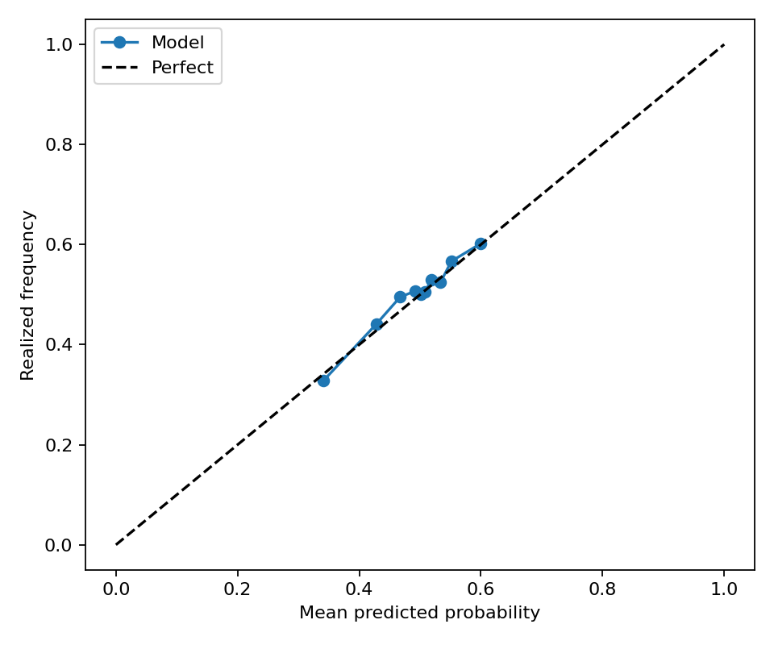
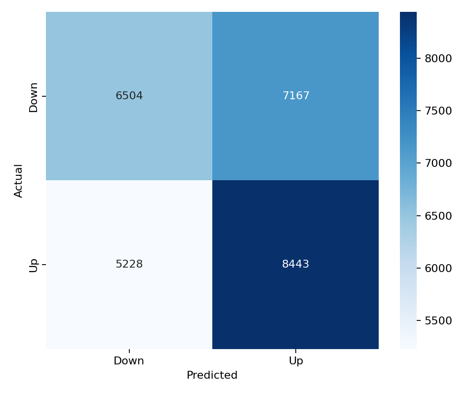

# BTC 15-Minute Direction Prediction System

### Codex Fix: Feature Order
Fixed a live-inference artifact bug where the saved model feature list was derived from aggregated feature importance, which reordered the model inputs relative to training. The pipeline now preserves the original trained feature order when saving `outputs/models/lightgbm_model.pkl`, preventing live predictions from feeding LightGBM columns in the wrong order.

### New Model: Balanced Dataset
The live prediction script now uses the balanced LightGBM artifact at `outputs/balanced_50_50/models/lightgbm_model.pkl`. The training pipeline balances each walk-forward train, validation, and test split independently after chronological splitting, so each split has exactly 50% UP and 50% DOWN labels without moving rows between train, validation, and test windows.

This removes the old class-prior issue where the original dataset was roughly 40% UP and 60% DOWN. On the original test set, an always-DOWN predictor could score about 60% accuracy, so plain accuracy was misleading. On the balanced test set, the always-UP and always-DOWN baselines are both 50%.

Balanced model results:

| Dataset | Rows | UP ratio | Accuracy | Balanced accuracy | ROC AUC | F1 |
| --- | ---: | ---: | ---: | ---: | ---: | ---: |
| Balanced test | 27,094 | 0.5000 | 0.5476 | 0.5476 | 0.5678 | 0.5713 |
| Balanced validation | 27,342 | 0.5000 | 0.5467 | 0.5467 | 0.5731 | 0.5767 |

The live script is now prediction-only: it fetches live Kraken Futures data, builds the ordered model feature row, averages the fold probabilities, and writes whether BTC is predicted to go UP or DOWN over the next 15 minutes. It no longer opens simulated long/short positions or tracks paper account equity.





## Progress: May 13, 2026
- Implemented live paper trading and web hosting
- Codex implemented a backtest trading spot BTC, but that's not what this model would be used for so it shouldn't be a big deal for now.
- Side note: I have previously tried to predict the actual BTC price in 15 minutes. A contamination of validation data tricked me into thinking that it worked, which it didn't at all. After some research, I have found predicting direction to be more feasible; XGBoost and LightGBM are the best lightweight models for this task, so I chose the latter. 

### Problems
- Kalshi's strike price is very hard to predict; it is not the price listed on Kraken, the main data source for the model, nor what is shown on CF Benchmarks' BRTI, which Kalshi claims its prices are based on. I'm not sure whether this will be a big problem, as all that the model needs to predict is the direction, not the exact value of bitcoin. Fortunately, I've found Polymarket's prices to match Kraken's very well. Sadly, Polymarket faces more regulation than Kalshi in the US.
- The model currently analyzes the order book at the beginning of the 15-minute contract and makes a prediction. I'm concerned that the orderbook may change significantly during the 15 minutes. Thus, I may work on a model that takes in `time-to-next-contract-expiry` as a parameter, and makes a prediction every minute until the contract expires.
- The model has a tendency to predict DOWN. Could this be due to bias in the training data?

Everything below is generated by Codex. 

---

This repository trains and runs a BTC 15-minute direction classifier using real market data. The model predicts the probability that BTC will close higher over the next 15-minute contract.

The project has two main modes:

- Historical pipeline: download data, build features, train LightGBM, and write evaluation artifacts.
- Live paper trading: fetch Kraken Futures data on 15-minute boundaries, make a prediction, track a paper position, and serve a live HTTP dashboard.

No synthetic order books, proxy liquidity, fake funding, or inferred depth feeds are generated.

## Setup

```bash
python3 -m venv binary-venv
binary-venv/bin/pip install -r references/requirements.txt
```

The committed paper-trading config expects the trained model at:

```text
outputs/models/lightgbm_model.pkl
```

## Data Sources

The historical pipeline uses:

- Kraken Futures OHLCV and funding data through `ccxt`.
- Binance Vision public `bookDepth` archives for historical depth data.
- Local parquet caches under `data/`.

The live paper trader uses Kraken Futures through `ccxt`:

- Symbol: `BTC/USD:USD`
- Timeframe: `15m`
- OHLCV history: 500 bars
- Order book depth: 50 levels
- Funding rate from the same exchange client

## Features

The trained model currently uses 43 feature columns from `outputs/models/feature_list.csv`.

Feature groups:

- Price/OHLCV: `open`, `high`, `low`, `close`, `volume`, `log_return`, `close_open_range`, `high_low_range`, `vwap`, `vwap_distance`
- Returns: rolling returns over 1, 3, 5, 15, 30, and 60 bars
- Volatility: realized volatility over 1, 3, 5, 15, 30, and 60 bars
- Parkinson volatility: 1, 3, 5, 15, 30, and 60 bar windows
- Regime/session: `hurst_exponent`, `rolling_entropy`, `trend_strength`, `realized_vol_percentile`, `session_asia`, `session_europe`, `session_us`
- Derivatives/funding: `funding_rate`, `funding_change`, `funding_zscore`

The configured feature windows are:

```yaml
price_windows: [1, 3, 5, 15, 30, 60]
orderbook_levels: [5, 10, 20, 50]
rolling_windows: [20, 60, 240]
target_horizon_bars: 1
target_horizon_minutes: 15
```

The strongest features by mean absolute SHAP value in the current trained artifact are:

| Feature | Mean abs SHAP |
| --- | ---: |
| `volume` | 0.06530 |
| `high_low_range` | 0.03927 |
| `parkinson_volatility_3` | 0.03656 |
| `rolling_entropy` | 0.03647 |
| `parkinson_volatility_15` | 0.03437 |
| `parkinson_volatility_5` | 0.02918 |
| `parkinson_volatility_30` | 0.02512 |
| `rolling_return_3` | 0.02445 |
| `vwap_distance` | 0.01784 |
| `rolling_return_5` | 0.01634 |

The strongest features by LightGBM gain are:

| Feature | Gain |
| --- | ---: |
| `volume` | 7915.17 |
| `high_low_range` | 5961.17 |
| `rolling_entropy` | 4011.80 |
| `parkinson_volatility_3` | 3616.58 |
| `rolling_return_5` | 3133.76 |
| `parkinson_volatility_15` | 3083.48 |
| `rolling_return_3` | 2996.80 |
| `parkinson_volatility_5` | 2934.74 |
| `hurst_exponent` | 2703.42 |
| `parkinson_volatility_30` | 2446.15 |

## Model

The model is a walk-forward LightGBM binary classifier. The saved artifact contains 17 fold models and averages their predicted probabilities in live inference.

Target:

- Binary classification.
- `1` means BTC is up over the next 15-minute bar.
- `0` means BTC is flat/down over the next 15-minute bar.

LightGBM hyperparameters from `config/model.yaml`:

```yaml
objective: binary
n_estimators: 2000
learning_rate: 0.01
max_depth: 8
num_leaves: 64
subsample: 0.8
colsample_bytree: 0.8
reg_alpha: 1.0
reg_lambda: 1.0
random_state: 42
n_jobs: -1
force_col_wise: true
verbosity: -1
early_stopping_rounds: 100
```

Walk-forward split:

```yaml
train_bars: 12000
val_bars: 2000
test_bars: 2000
step_bars: 2000
```

Trading thresholds used by the historical backtest and live paper trader:

```yaml
long: 0.60
short: 0.40
```

Transaction assumptions:

```yaml
transaction_cost_bps: 2.0
slippage_bps: 1.0
```

## Performance

Current classification metrics from `outputs/metrics/classification_metrics.json`:

| Metric | Value |
| --- | ---: |
| Accuracy | 0.5981 |
| Balanced accuracy | 0.5378 |
| ROC AUC | 0.5887 |
| F1 | 0.3232 |
| Precision | 0.4913 |
| Recall | 0.2409 |
| MCC | 0.0934 |
| Log loss | 0.6637 |
| Information coefficient | 0.0139 |
| Mutual information | 0.0168 |

Financial metrics from the thresholded backtest in `outputs/metrics/financial_metrics.json`:

| Metric | Value |
| --- | ---: |
| Hit rate | 0.0659 |
| Profit factor | 0.7307 |
| Sharpe ratio | -7.6860 |
| Sortino ratio | -4.8676 |
| Max drawdown | -1.3643 |
| Turnover | 0.1400 |

Interpretation: the classifier has measurable but modest directional signal. The included long/short threshold strategy is not profitable after the configured costs in the current artifact, so treat it as a research and paper-trading system, not a production trading strategy.

Regime highlights from `outputs/metrics/regime_metrics.json`:

- Low volatility regime: accuracy 0.6281, ROC AUC 0.6037
- Medium volatility regime: accuracy 0.5948, ROC AUC 0.5815
- High volatility regime: accuracy 0.5625, ROC AUC 0.5650
- US session: accuracy 0.5778, ROC AUC 0.5812
- Non-US session: accuracy 0.6104, ROC AUC 0.5894

## Run Historical Pipeline

Run with cached parquet data when available:

```bash
binary-venv/bin/python scripts/run_pipeline.py
```

Force a fresh data download:

```bash
binary-venv/bin/python scripts/run_pipeline.py --force-download
```

The first full run can take a while because it downloads public historical archives.

Outputs:

```text
outputs/
├── models/
│   ├── lightgbm_model.pkl
│   └── feature_list.csv
├── predictions/
│   ├── backtest.parquet
│   ├── probabilities.parquet
│   └── test_predictions.parquet
├── metrics/
│   ├── classification_metrics.json
│   ├── feature_importance.csv
│   ├── feature_psi.json
│   ├── financial_metrics.json
│   ├── regime_metrics.json
│   └── shap_importance.csv
└── figures/
    ├── calibration_curve.png
    ├── confusion_matrix.png
    ├── feature_importance.png
    ├── pnl_curve.png
    ├── prediction_actual_heatmap.png
    ├── regime_performance.png
    └── shap_importance.png
```

## Run Live Paper Trading

Run one live prediction cycle:

```bash
binary-venv/bin/python binary-paper-trading/run_live_paper_trading.py --once
```

Run continuously:

```bash
binary-venv/bin/python binary-paper-trading/run_live_paper_trading.py
```

The live trader:

- Wakes shortly after each 15-minute boundary.
- Fetches Kraken Futures OHLCV, order book, and funding data.
- Builds the same live feature columns expected by the saved model.
- Averages probabilities across the saved LightGBM fold models.
- Writes one prediction row per cycle to `binary-paper-trading/logs/predictions.csv`.
- Evaluates pending predictions once the matching future 15-minute candle is available.
- Does not place or simulate long/short positions.

Paper-trading config is in `binary-paper-trading/config.yaml`:

```yaml
model_path: outputs/balanced_50_50/models/lightgbm_model.pkl
seconds_after_boundary: 10
retry_attempts: 3
retry_sleep_seconds: 5
```

Paper-trading logs:

```text
binary-paper-trading/logs/
├── paper_trading.log
├── predictions.csv
├── actual_outcomes.csv
├── price_actions.csv
└── feature_snapshots.jsonl
```

## Run HTTP Dashboard

Start the dashboard server:

```bash
binary-venv/bin/python binary-paper-trading/serve_paper_trading_dashboard.py
```

Open:

```text
http://127.0.0.1:8080
```

Useful options:

```bash
binary-venv/bin/python binary-paper-trading/serve_paper_trading_dashboard.py \
  --host 127.0.0.1 \
  --port 8080 \
  --poll-seconds 5 \
  --live-price-seconds 10
```

Dashboard features:

- Current contract timestamp.
- Current prediction direction and probability.
- Prediction input close: the exact 15-minute candle close used by the model for the current prediction.
- Live BTC price: refreshed every 10 seconds from Kraken Futures best bid/ask midpoint.
- Countdown to the next scheduled prediction.
- Historical prediction table with timestamp, predicted direction, probability, and actual direction.
- Green/red row highlighting for correct/incorrect evaluated predictions.
- Confusion matrix computed from de-duplicated paper-trading contracts.

If the paper trader is running, the dashboard updates as `predictions.csv` changes. If the paper trader is stopped, historical predictions remain static while the countdown and live BTC price continue updating.

## Real Data Boundary

Public unauthenticated access is available for Kraken Futures data and Binance Vision book depth archives. Coinbase, Bybit, OKX, and other RTI constituent integrations are represented as explicit ingestion stubs that require real API/archive credentials or exported data. They intentionally raise instead of substituting proxy data.
