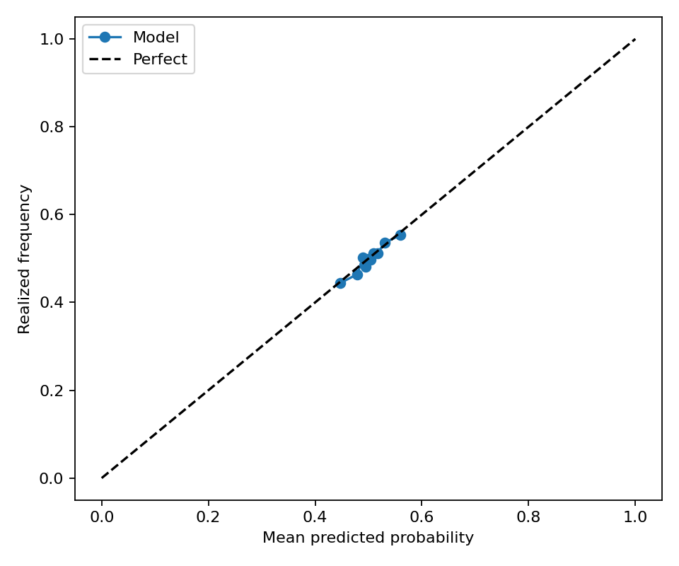
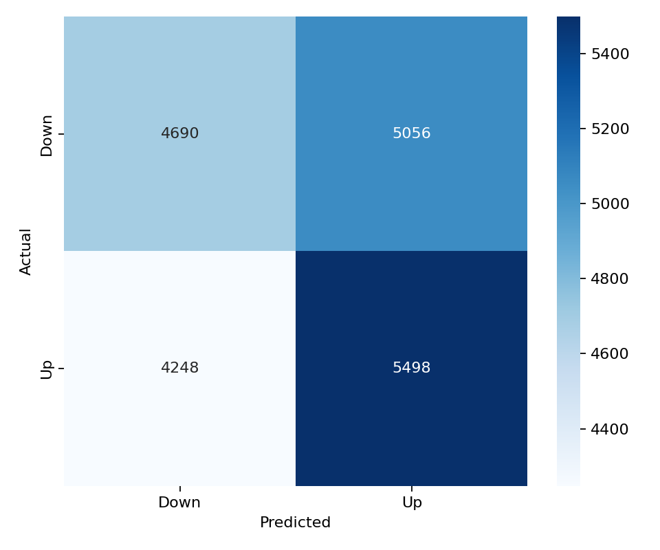

# SOL 15-Minute Direction Model

This folder contains a balanced LightGBM direction model for `SOL_USDT`. It uses the same 43 feature columns, LightGBM hyperparameters, walk-forward split configuration, balanced train/validation/test sampling, and evaluation metric suite as the latest BTC balanced model.

## Files

- `models/lightgbm_model.pkl`: saved walk-forward LightGBM model ensemble.
- `models/feature_list.csv`: ordered model feature list copied from the BTC balanced model.
- `predictions/test_predictions.parquet`: balanced walk-forward test predictions.
- `predictions/validation_predictions.parquet`: balanced validation predictions.
- `metrics/classification_metrics.json`: test classification metrics.
- `metrics/validation_classification_metrics.json`: validation classification metrics.
- `metrics/regime_metrics.csv`: test metrics split by volatility and trading-session regimes.
- `metrics/validation_regime_metrics.csv`: validation metrics split by volatility and trading-session regimes.
- `figures/validation_calibration_curve.png`: validation calibration curve.
- `figures/validation_confusion_matrix.png`: validation confusion matrix.

## Data

- Raw aligned rows: 50,000
- Feature dataset rows: 35,126
- Model features: 43
- Target: `1` means SOL closes higher over the next 15-minute bar; `0` means flat/down.

The class balance report is saved at `metrics/split_class_balance.csv`. Each train, validation, and test split is balanced independently after chronological splitting to avoid cross-contamination.

## Model Architecture

LightGBM parameters:

```json
{
  "colsample_bytree": 0.8,
  "force_col_wise": true,
  "learning_rate": 0.01,
  "max_depth": 8,
  "n_estimators": 2000,
  "n_jobs": -1,
  "num_leaves": 64,
  "objective": "binary",
  "random_state": 42,
  "reg_alpha": 1.0,
  "reg_lambda": 1.0,
  "subsample": 0.8,
  "verbosity": -1
}
```

Walk-forward split:

```json
{
  "step_bars": 2000,
  "test_bars": 2000,
  "train_bars": 12000,
  "val_bars": 2000
}
```

## Performance

| Dataset | Rows | UP ratio | Accuracy | Balanced accuracy | ROC AUC | F1 | Precision | Recall | MCC |
| --- | ---: | ---: | ---: | ---: | ---: | ---: | ---: | ---: | ---: |
| test | 19,546 | 0.5000 | 0.5160 | 0.5160 | 0.5263 | 0.5410 | 0.5144 | 0.5704 | 0.0321 |
| validation | 19,492 | 0.5000 | 0.5227 | 0.5227 | 0.5327 | 0.5417 | 0.5209 | 0.5641 | 0.0455 |

## Regime Performance

Test regimes:

| Regime | Rows | UP ratio | Accuracy | Balanced accuracy | ROC AUC | F1 |
| --- | ---: | ---: | ---: | ---: | ---: | ---: |
| volatility_regime=medium | 5,816 | 0.4954 | 0.5199 | 0.5204 | 0.5257 | 0.5415 |
| session_europe=1 | 7,320 | 0.4943 | 0.5178 | 0.5180 | 0.5286 | 0.5264 |
| session_us=0 | 12,207 | 0.4993 | 0.5177 | 0.5177 | 0.5289 | 0.5398 |
| session_asia=0 | 13,036 | 0.4997 | 0.5161 | 0.5161 | 0.5262 | 0.5407 |
| volatility_regime=low | 7,741 | 0.5025 | 0.5163 | 0.5160 | 0.5267 | 0.5467 |
| session_asia=1 | 6,510 | 0.5006 | 0.5157 | 0.5156 | 0.5266 | 0.5415 |
| session_europe=0 | 12,226 | 0.5034 | 0.5149 | 0.5144 | 0.5245 | 0.5492 |
| session_us=1 | 7,339 | 0.5012 | 0.5131 | 0.5130 | 0.5220 | 0.5429 |
| volatility_regime=high | 5,989 | 0.5013 | 0.5116 | 0.5115 | 0.5262 | 0.5328 |

Validation regimes:

| Regime | Rows | UP ratio | Accuracy | Balanced accuracy | ROC AUC | F1 |
| --- | ---: | ---: | ---: | ---: | ---: | ---: |
| session_europe=1 | 7,299 | 0.4921 | 0.5273 | 0.5274 | 0.5379 | 0.5252 |
| volatility_regime=medium | 6,047 | 0.4955 | 0.5267 | 0.5270 | 0.5320 | 0.5400 |
| session_us=0 | 12,194 | 0.4985 | 0.5251 | 0.5252 | 0.5375 | 0.5428 |
| session_asia=1 | 6,511 | 0.5015 | 0.5251 | 0.5249 | 0.5357 | 0.5507 |
| volatility_regime=low | 7,093 | 0.5020 | 0.5233 | 0.5231 | 0.5338 | 0.5489 |
| session_asia=0 | 12,981 | 0.4993 | 0.5215 | 0.5215 | 0.5311 | 0.5370 |
| session_europe=0 | 12,193 | 0.5047 | 0.5199 | 0.5193 | 0.5286 | 0.5509 |
| session_us=1 | 7,298 | 0.5025 | 0.5186 | 0.5184 | 0.5247 | 0.5398 |
| volatility_regime=high | 6,352 | 0.5020 | 0.5181 | 0.5180 | 0.5325 | 0.5350 |

Best test regime by balanced accuracy: `volatility_regime=medium` with balanced accuracy 0.5204 and ROC AUC 0.5257.

Best validation regime by balanced accuracy: `session_europe=1` with balanced accuracy 0.5274 and ROC AUC 0.5379.

## Feature Importance

Top features by mean absolute SHAP:

| Feature | Mean abs SHAP |
| --- | ---: |
| `log_return` | 0.02626 |
| `rolling_return_3` | 0.02146 |
| `close_open_range` | 0.01784 |
| `rolling_return_5` | 0.01030 |
| `hurst_exponent` | 0.00873 |
| `rolling_return_30` | 0.00803 |
| `high_low_range` | 0.00733 |
| `vwap_distance` | 0.00731 |
| `trend_strength` | 0.00702 |
| `funding_zscore` | 0.00644 |

Top features by LightGBM gain:

| Feature | Gain |
| --- | ---: |
| `rolling_return_3` | 1574.56337 |
| `log_return` | 1379.75440 |
| `rolling_return_5` | 1178.73629 |
| `volume` | 1176.05892 |
| `hurst_exponent` | 1174.49724 |
| `funding_zscore` | 1171.34777 |
| `rolling_entropy` | 921.18522 |
| `rolling_return_15` | 917.47916 |
| `vwap_distance` | 912.11749 |
| `high_low_range` | 896.37927 |

## Validation Figures




