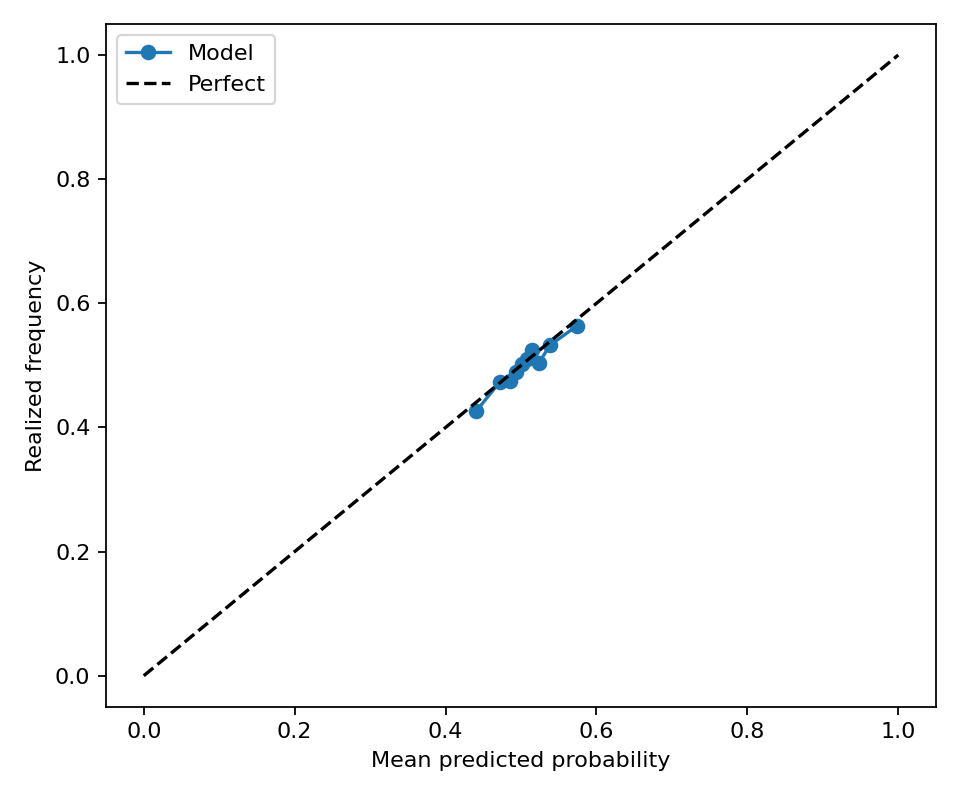
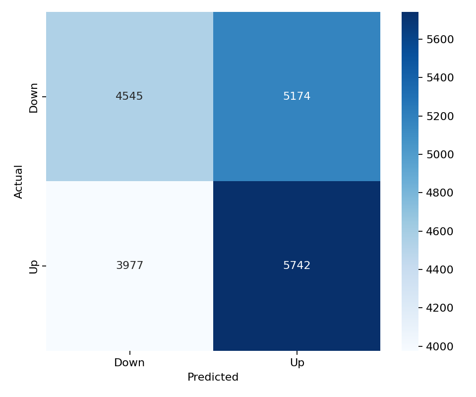

# XRP 15-Minute Direction Model

This folder contains a balanced LightGBM direction model for `XRP_USDT`. It uses the same 43 feature columns, LightGBM hyperparameters, walk-forward split configuration, balanced train/validation/test sampling, and evaluation metric suite as the latest BTC balanced model.

## Files

- `models/lightgbm_model.pkl`: saved walk-forward LightGBM model ensemble.
- `models/feature_list.csv`: ordered model feature list copied from the BTC balanced model.
- `predictions/test_predictions.parquet`: balanced walk-forward test predictions.
- `predictions/validation_predictions.parquet`: balanced validation predictions.
- `metrics/classification_metrics.json`: test classification metrics.
- `metrics/validation_classification_metrics.json`: validation classification metrics.
- `metrics/regime_metrics.csv`: test metrics split by volatility and trading-session regimes.
- `metrics/validation_regime_metrics.csv`: validation metrics split by volatility and trading-session regimes.
- `figures/validation_calibration_curve.png`: validation calibration curve.
- `figures/validation_confusion_matrix.png`: validation confusion matrix.

## Data

- Raw aligned rows: 50,000
- Feature dataset rows: 35,126
- Model features: 43
- Target: `1` means XRP closes higher over the next 15-minute bar; `0` means flat/down.

The class balance report is saved at `metrics/split_class_balance.csv`. Each train, validation, and test split is balanced independently after chronological splitting to avoid cross-contamination.

## Model Architecture

LightGBM parameters:

```json
{
  "colsample_bytree": 0.8,
  "force_col_wise": true,
  "learning_rate": 0.01,
  "max_depth": 8,
  "n_estimators": 2000,
  "n_jobs": -1,
  "num_leaves": 64,
  "objective": "binary",
  "random_state": 42,
  "reg_alpha": 1.0,
  "reg_lambda": 1.0,
  "subsample": 0.8,
  "verbosity": -1
}
```

Walk-forward split:

```json
{
  "step_bars": 2000,
  "test_bars": 2000,
  "train_bars": 12000,
  "val_bars": 2000
}
```

## Performance

| Dataset | Rows | UP ratio | Accuracy | Balanced accuracy | ROC AUC | F1 | Precision | Recall | MCC |
| --- | ---: | ---: | ---: | ---: | ---: | ---: | ---: | ---: | ---: |
| test | 19,468 | 0.5000 | 0.5177 | 0.5177 | 0.5310 | 0.5571 | 0.5150 | 0.6067 | 0.0359 |
| validation | 19,438 | 0.5000 | 0.5292 | 0.5292 | 0.5391 | 0.5565 | 0.5260 | 0.5908 | 0.0589 |

## Regime Performance

Test regimes:

| Regime | Rows | UP ratio | Accuracy | Balanced accuracy | ROC AUC | F1 |
| --- | ---: | ---: | ---: | ---: | ---: | ---: |
| session_us=0 | 12,160 | 0.5010 | 0.5248 | 0.5246 | 0.5397 | 0.5618 |
| volatility_regime=medium | 6,816 | 0.5109 | 0.5246 | 0.5225 | 0.5326 | 0.5717 |
| session_asia=1 | 6,485 | 0.5022 | 0.5215 | 0.5211 | 0.5342 | 0.5626 |
| volatility_regime=low | 7,635 | 0.4965 | 0.5202 | 0.5209 | 0.5397 | 0.5623 |
| session_europe=0 | 12,178 | 0.5002 | 0.5207 | 0.5207 | 0.5339 | 0.5578 |
| session_asia=0 | 12,983 | 0.4989 | 0.5158 | 0.5159 | 0.5294 | 0.5543 |
| session_europe=1 | 7,290 | 0.4996 | 0.5126 | 0.5127 | 0.5262 | 0.5560 |
| session_us=1 | 7,308 | 0.4984 | 0.5059 | 0.5062 | 0.5171 | 0.5494 |
| volatility_regime=high | 5,017 | 0.4905 | 0.5043 | 0.5054 | 0.5137 | 0.5280 |

Validation regimes:

| Regime | Rows | UP ratio | Accuracy | Balanced accuracy | ROC AUC | F1 |
| --- | ---: | ---: | ---: | ---: | ---: | ---: |
| volatility_regime=medium | 7,023 | 0.5095 | 0.5352 | 0.5340 | 0.5403 | 0.5687 |
| session_asia=0 | 12,947 | 0.4984 | 0.5325 | 0.5327 | 0.5429 | 0.5593 |
| session_europe=1 | 7,278 | 0.4990 | 0.5322 | 0.5323 | 0.5410 | 0.5668 |
| session_us=0 | 12,159 | 0.5000 | 0.5301 | 0.5301 | 0.5392 | 0.5570 |
| session_us=1 | 7,279 | 0.5001 | 0.5278 | 0.5278 | 0.5389 | 0.5558 |
| session_europe=0 | 12,160 | 0.5006 | 0.5275 | 0.5274 | 0.5380 | 0.5502 |
| volatility_regime=high | 5,145 | 0.4915 | 0.5263 | 0.5268 | 0.5356 | 0.5345 |
| volatility_regime=low | 7,270 | 0.4968 | 0.5254 | 0.5260 | 0.5401 | 0.5595 |
| session_asia=1 | 6,491 | 0.5032 | 0.5227 | 0.5223 | 0.5314 | 0.5510 |

Best test regime by balanced accuracy: `session_us=0` with balanced accuracy 0.5246 and ROC AUC 0.5397.

Best validation regime by balanced accuracy: `volatility_regime=medium` with balanced accuracy 0.5340 and ROC AUC 0.5403.

## Feature Importance

Top features by mean absolute SHAP:

| Feature | Mean abs SHAP |
| --- | ---: |
| `vwap_distance` | 0.03504 |
| `log_return` | 0.02431 |
| `funding_zscore` | 0.01321 |
| `rolling_return_3` | 0.01312 |
| `funding_rate` | 0.01171 |
| `close_open_range` | 0.01056 |
| `low` | 0.00916 |
| `rolling_volatility_3` | 0.00898 |
| `rolling_return_5` | 0.00877 |
| `rolling_return_30` | 0.00853 |

Top features by LightGBM gain:

| Feature | Gain |
| --- | ---: |
| `vwap_distance` | 2377.25981 |
| `funding_zscore` | 1527.13361 |
| `log_return` | 1515.49528 |
| `rolling_return_3` | 1457.39638 |
| `rolling_return_30` | 1387.15045 |
| `rolling_return_5` | 1358.14299 |
| `rolling_return_15` | 1349.60548 |
| `volume` | 1337.99953 |
| `funding_rate` | 1260.56361 |
| `hurst_exponent` | 1223.82758 |

## Validation Figures




